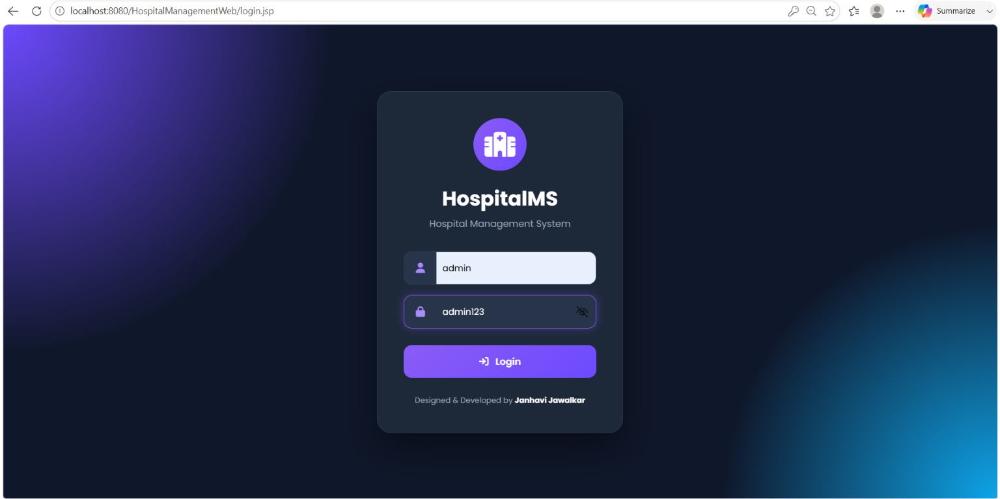
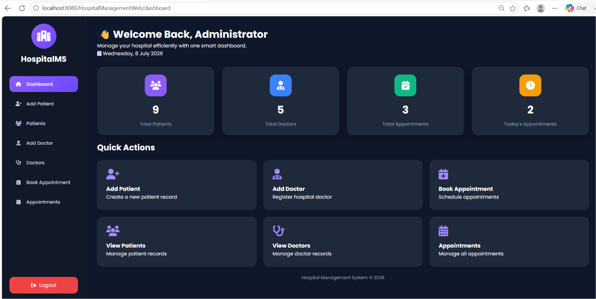
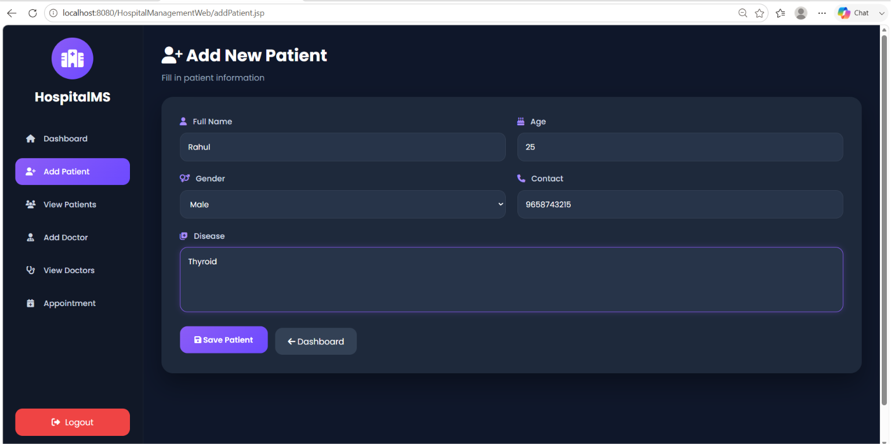
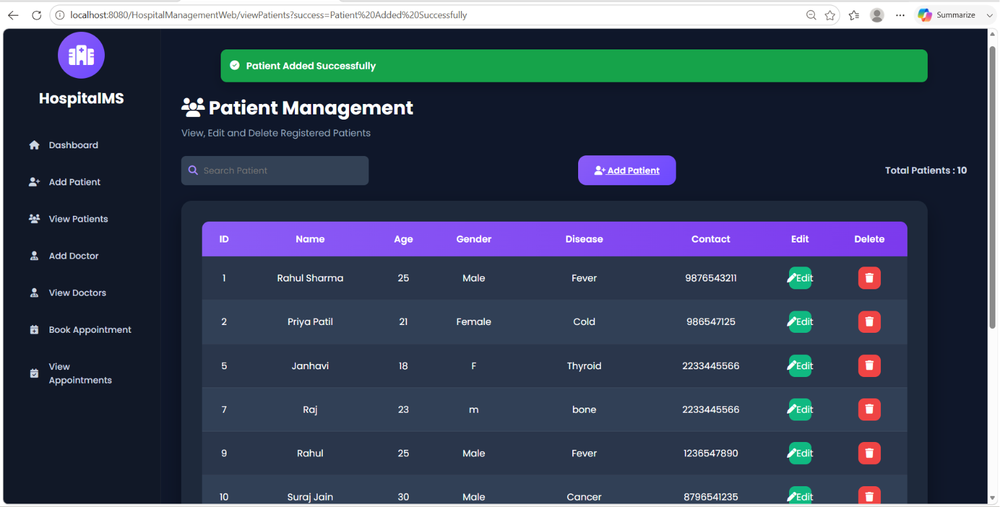
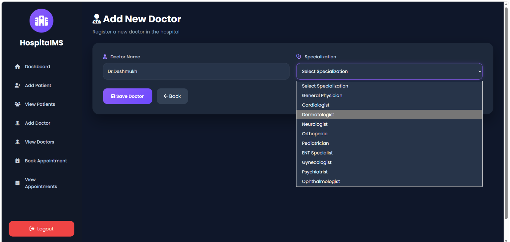
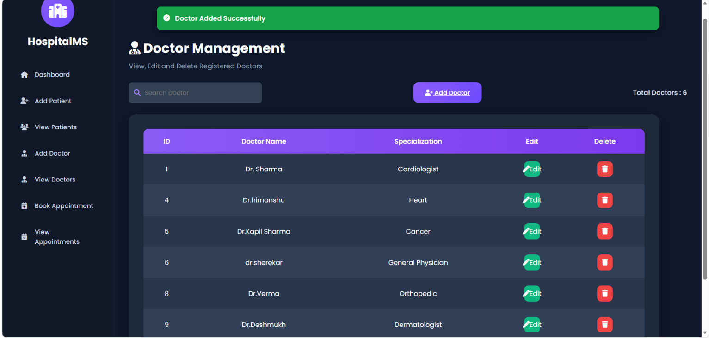

# 🏥 Hospital Management System

<p align="center">

A full-stack Java Web application for managing hospital operations including patient registration, doctor management, appointment scheduling, and administrative dashboard.

Built using **Java, JSP, Servlets, JDBC, MySQL, and Apache Tomcat** following the **MVC Architecture**.

</p>

---

## 📌 Overview

Hospital Management System is a web-based application designed to simplify the daily operations of a hospital. It provides a centralized platform for administrators to efficiently manage patient records, doctor information, and appointment scheduling through an intuitive and responsive interface.

The application follows the **Model-View-Controller (MVC)** architecture, ensuring clean code organization, scalability, and maintainability.

---

# ✨ Key Features

### 👤 Patient Management
- Register new patients
- View complete patient records
- Edit patient details
- Delete patient records
- Search patients instantly

---

### 👨‍⚕️ Doctor Management
- Register doctors
- View all doctors
- Update doctor information
- Delete doctor records
- Search doctors by name or specialization

---

### 📅 Appointment Management
- Book appointments
- View all appointments
- Search appointments by date
- Delete appointments
- Prevent duplicate appointments

---

### 📊 Dashboard
- Total Patients
- Total Doctors
- Total Appointments
- Today's Appointments
- Quick Action Cards
- Professional Admin Interface

---

### 🔐 Authentication
- Secure Admin Login
- Session Management
- Logout Functionality

---

# 🏗️ System Architecture

The application follows the **MVC (Model-View-Controller)** design pattern.

```
                 User
                   │
                   ▼
              JSP Pages
                (View)
                   │
                   ▼
             Java Servlets
            (Controller)
                   │
                   ▼
             DAO Classes
         (Business Logic)
                   │
                   ▼
              JDBC Driver
                   │
                   ▼
              MySQL Database
```

---

# 💻 Technology Stack

| Category | Technology |
|-----------|------------|
| Language | Java |
| Frontend | HTML5, CSS3, JavaScript |
| UI Icons | Font Awesome |
| Backend | JSP & Servlets |
| Database | MySQL |
| Connectivity | JDBC |
| Server | Apache Tomcat 10 |
| IDE | Eclipse IDE |
| Architecture | MVC |

---

# 📂 Project Structure

```
Hospital-Management-System-Java-Web-JSP
│
├── src
│   ├── com.hospital.dao
│   ├── com.hospital.model
│   ├── com.hospital.servlet
│   └── com.hospital.util
│
├── WebContent
│   ├── css
│   ├── js
│   ├── components
│   ├── images
│   ├── *.jsp
│   └── WEB-INF
│
├── screenshots
│
├── hospital_db.sql
│
└── README.md
```

---

# 📸 Application Preview

## LogIn



---
## Dashboard



---

## Patient Management

## Add Patient



---

## View Patients



## Doctor Management

## Add Doctor



---

## View Doctors



---

## Appointment Management

## Book Appointment


---

## View Appointments


---

# 🗄️ Database

The project uses **MySQL** as the backend database.

### Main Tables

- Patients
- Doctors
- Appointments

Database schema is included in:

```
hospital_db.sql
```

---

# ⚙️ Installation Guide

### Clone Repository

```bash
git clone https://github.com/janhavijawalkar/Hospital-Management-System-Java-Web-JSP.git
```

---

### Import Project

Import the project into **Eclipse IDE** as an existing Dynamic Web Project.

---

### Configure Tomcat

Configure **Apache Tomcat 10.x** in Eclipse.

---

### Import Database

Open MySQL Workbench and execute

```
hospital_db.sql
```

---

### Configure Database

Update database credentials inside

```
DBConnection.java
```

```java
String url="jdbc:mysql://localhost:3306/hospital_db";
String username="root";
String password="your_password";
```

---

### Run Application

Run on Apache Tomcat.

Open:

```
http://localhost:8080/Hospital-Management-System-Java-Web-JSP/
```

---

# 📸 Screens Included

- Dashboard
- Add Patient
- View Patients
- Add Doctor
- View Doctors
- Book Appointment
- View Appointments

---

# 🚀 Future Enhancements

- Doctor Availability
- Patient Medical History
- Prescription Module
- Billing & Payment
- Email Notifications
- Appointment Status Tracking
- Reports & Analytics
- Role-Based Authentication
- Responsive Mobile Dashboard

---

# 📚 Learning Outcomes

This project helped in understanding:

- Java Web Development
- MVC Architecture
- JSP & Servlet Programming
- JDBC Connectivity
- CRUD Operations
- Session Management
- Dynamic UI Development
- Database Design
- MySQL Integration
- Apache Tomcat Deployment
- Git & GitHub Version Control

---

# 👩‍💻 Developer

**Janhavi Jawalkar**

B.Tech Computer Science & Engineering

PR Pote Patil College of Engineering, Amravati

GitHub

https://github.com/janhavijawalkar

---

# ⭐ Support

If you found this project helpful, consider giving it a ⭐ on GitHub.

It motivates further improvements and future open-source contributions.
